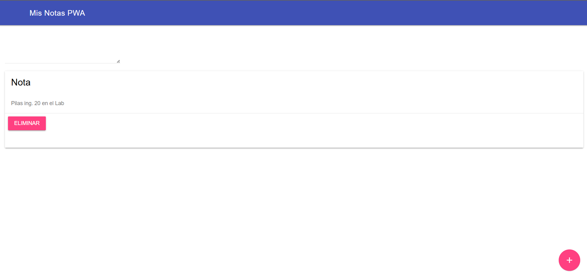

# Lab1-Aplicacion-de-Notas

Una aplicación web progresiva (PWA) desarrollada como práctica integrativa para la asignatura *Programación Integrativa de Componentes* en ESPE. Permite crear, visualizar y eliminar notas con una interfaz moderna basada en Material Design Lite (MDL), y funciona sin conexión gracias a un Service Worker.

---

## 🚀 Características

- Interfaz limpia y responsiva con componentes MDL.
- Añadir y eliminar notas dinámicamente.
- Notificaciones tipo Snackbar para retroalimentación del usuario.
- Instalación como aplicación en escritorio o móvil.
- Funcionalidad offline mediante Service Worker.
- Estructura modular y trazable para futuras mejoras.

---

## 🛠️ Instalación y Ejecución

1. Clona o descarga el repositorio.
2. Asegúrate de tener un servidor local (como Live Server en VS Code).
3. Abre `index.html` en un navegador moderno (Chrome, Firefox, Edge).
4. Instala la app desde el navegador si se ofrece.
5. Prueba la funcionalidad offline cerrando la conexión y recargando.

---

## 🧩 Componentes Utilizados (Material Design Lite)

- `mdl-layout`: estructura principal con cabecera fija.
- `mdl-textfield`: entrada de texto tipo `textarea`.
- `mdl-button--fab`: botón flotante para añadir notas.
- `mdl-card`: visualización de cada nota.
- `mdl-snackbar`: notificaciones breves.

---

## 📦 Funcionalidad PWA

- **Manifest.json**: define nombre, íconos, colores y comportamiento de instalación.
- **Service Worker**:
  - `install`: cachea archivos esenciales.
  - `fetch`: estrategia *Cache First* para servir recursos offline.
- **Registro**: se realiza en `app.js` al cargar la ventana.

---

## ✅ Mejoras Implementadas

- Se corrigió la inicialización de componentes MDL dinámicos (`upgradeElement`).
- Se reubicó el botón flotante dentro del layout para compatibilidad visual.
- Se ajustó el `label` del textarea para cumplir con la sintaxis MDL.
- Se verificó la carga correcta de `app.js` y se aseguró su ejecución.
- Se modularizó la función de creación de tarjetas con eliminación y feedback.

---

## 📌 Recomendaciones Futuras

- Implementar persistencia de notas con `localStorage` o `IndexedDB`.
- Añadir validación visual en campos vacíos.
- Mejorar accesibilidad (atributos ARIA, navegación por teclado).
- Internacionalización para múltiples idiomas.

---

## 👨‍🏫 Autor

**Anthony Mejía**  
Universidad de las Fuerzas Armadas ESPE  
Departamento de Ciencias de la Computación  
Asignatura: Programación Integrativa de Componentes  
Docente: Ing. Paulo Galarza, Mgs.

---

Figura 1
Codigo en funcionamiento 

Nota: La imagen muestra la aplicacion de notas funionando correctamente. 
